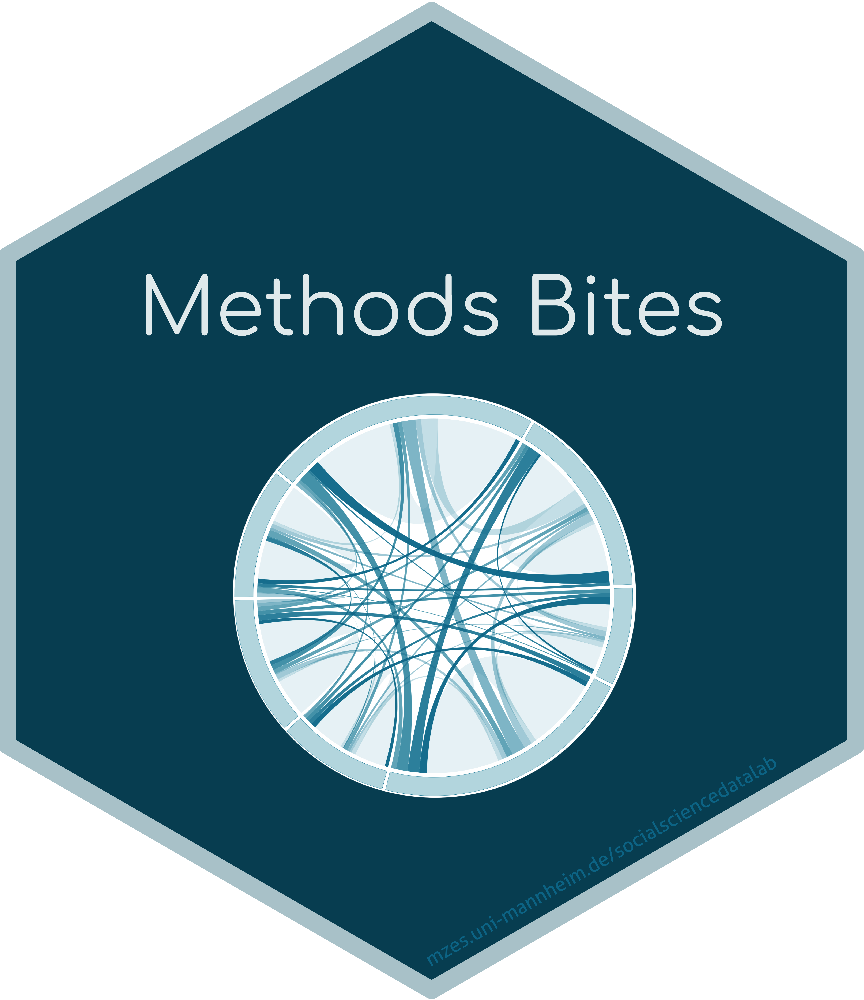

# Welcome to the Social Science Data Lab!   

The Social Science Data Lab is an [event series](https://www.mzes.uni-mannheim.de/socialsciencedatalab/page/events) at the [Mannheim Centre for European Social Research (MZES)](https://www.mzes.uni-mannheim.de/d7/en). It offers a platform for young scholars to present and discuss cutting-edge methods for the collection, management, analysis, and visualization of data in the social sciences.

Organized by our [team](https://www.mzes.uni-mannheim.de/socialsciencedatalab/page/team) of members of the [MZES Data and Methods Unit](https://www.mzes.uni-mannheim.de/d7/en/dm-unit), the Social Science Data Lab hosts regular events of various formats, including input talks, roundtables, and workshops.

To create a systematic and lasting infrastructure that provides accessible and applied illustrations of the materials covered at our events, we have also founded  a blog: [Methods Bites](https://www.mzes.uni-mannheim.de/socialsciencedatalab/). Our expanding collection of blog posts makes these materials available to a broader audience and provides a forum for peer discussions and mutual learning.

You can find the material for our events here:

| Topic                      |                                                              | Speaker | Repository | Blog post | Recording |
|----------------------------|---------------------------------------------------------------|------------|------------|-----------|-----------|
| **General**                    | Building an infrastructure for data driven research       | [Philipp Zumstein](https://www.bib.uni-mannheim.de/philipp-zumstein/) |   [GitHub](https://github.com/SocialScienceDataLab/building-infrastructure-for-data-driven-research)        |           |           |
|                            | Crowdsource                                                   |  [Chung-hong Chan](https://www.mzes.uni-mannheim.de/d7/en/profiles/chung-hong-chan) |    [GitHub](https://github.com/SocialScienceDataLab/Crowdsource)      |           |           |
|                            | Introduction to Unipark                                       |   [Florian Keusch](http://floriankeusch.weebly.com) |  [GitHub](https://github.com/SocialScienceDataLab/Introduction-to-Unipark-)       |           |           |
|                            | Open Science Primer                                           |   [Eike M. Rinke](http://mkw.uni-mannheim.de/prof_dr_hartmut_wessler/dr_eike_rinke/) |  [GitHub](https://github.com/SocialScienceDataLab/Open-Science-Primer)       |           |           |
|                            | Remote computing services: bwCloud, bwHPC, and beyond         | Hendrik Winkhardt |    [GitHub](https://github.com/SocialScienceDataLab/remote-computing-services)       |           |      [YouTube](https://www.youtube.com/watch?v=bFsN4SHdDUk&t=28s)     |
|                            | Git essentials    | [Frie Preu](https://frie.codes)    |     [GitHub](https://github.com/SocialScienceDataLab/git-essentials)       |           |      [YouTube](https://m.youtube.com/watch?v=JS9cwCcf7DY)   |
| **Text (and code) processing** | `knitr`                                                       |[Sebastian Pink](https://www.sowi.uni-mannheim.de/kalter/team/akademische-mitarbeiterinnen-und-mitarbeiter/pink-dr-sebastian/)   |    [GitHub](https://github.com/SocialScienceDataLab/knitr)        |           |           |
|                            | LaTeX and Overleaf                                            | [Dennis Hammerschmidt](https://dennis-hammerschmidt.netlify.com/) and [Cosima Meyer](https://cosimameyer.rbind.io/) |    [GitHub](https://github.com/SocialScienceDataLab/LaTeX-intro)        |       [Methods Bites](https://www.mzes.uni-mannheim.de/socialsciencedatalab/article/latex-intro/)   |           |
|                            |                Reproducible and Dynamic Documents with RMarkdown with `reproducr`                                      | [Julia Schulte-Cloos](https://jschultecloos.github.io/) |   [GitHub](https://github.com/SocialScienceDataLab/reproducible-documents)   |        |           |
| **Statistical software**       | Advances in R                                                 |  [Simon Munzert](https://simonmunzert.github.io/) |    [GitHub](https://github.com/SocialScienceDataLab/advances-in-r)      |           |           |
|                            | Renku                                                         |  [Christine Choirat](https://scholar.harvard.edu/cchoirat) and Emma Jablonski |    [GitHub](https://github.com/SocialScienceDataLab/Renku)      |           |         [YouTube]()  |
|                            | R intro                                                       |  [Denis Cohen](denis-cohen.github.io) and [Julian Bernauer](julianbernauer.github.io) |   [GitHub](https://github.com/SocialScienceDataLab/R_Intro)       |           |           |
|                            | Write your own R package                                                       | [Cosima Meyer](https://cosimameyer.rbind.io/)  and  [Dennis Hammerschmidt](https://dennis-hammerschmidt.netlify.com/) |      |   [Methods Bites](https://www.mzes.uni-mannheim.de/socialsciencedatalab/article/r-package/)        |           |
| **Data collection**            | Intro to web scraping with R                                  |   [Simon Munzert](https://simonmunzert.github.io/) | [GitHub](https://github.com/SocialScienceDataLab/Intro-to-web-scraping-with-R)        |           |           |
|                            | Computer vision with Face++ and Azure                         |   [Theresa Küntzler](https://www.polver.uni-konstanz.de/cdm/people/students/kuentzler/) |     [GitHub](https://github.com/SocialScienceDataLab/computer-vision-with-facepp-and-microsoft-azure)    |         |      [YouTube](https://www.youtube.com/watch?v=vTZKwz8Xs80&t=1s)     |
|                            | Using web logs and smartphone records for social research                                      |  [Ruben Bach](https://ruben-bach.com/) |       |    [Methods Bites](https://www.mzes.uni-mannheim.de/socialsciencedatalab/article/using-web-logs/)       |   |     | [YouTube](https://www.youtube.com/watch?v=SpoXEEdsNfE)
|                            | Collecting and analyzing Twitter Data Using R                                |    [Simon Kühne](http://simon-kuehne.de/) |  [GitHub](https://github.com/SocialScienceDataLab/Twitter)        |      [Methods Bites](https://www.mzes.uni-mannheim.de/socialsciencedatalab/article/collecting-and-analyzing-twitter-using-r/)     |           |
| **Survey**                     | Factorial survey design                                       | [Carsten Sauer](https://scholar.google.com/citations?user=FPtXA1sAAAAJ&hl=en) |     [GitHub](https://github.com/SocialScienceDataLab/factorial-surveys)        |           |   [YouTube](https://www.youtube.com/watch?v=RXEFGC_Abm8)        |
| **Data management**            | Efficient data management with R                              |  [Denis Cohen](https://denis-cohen.github.io/), [Cosima Meyer](https://cosimameyer.rbind.io/), [Marcel Neunhoeffer](https://www.marcel-neunhoeffer.com/) and Oliver Rittmann |   [GitHub](https://github.com/SocialScienceDataLab/efficient-data-r)         |    [Methods Bites](https://www.mzes.uni-mannheim.de/socialsciencedatalab/article/efficient-data-r/)       |           |
| **Data analysis**              | Topic-based and cross-lingual scaling of political text       |   [Federico Nanni](https://federiconanni.com) |  [GitHub](https://github.com/SocialScienceDataLab/Topic-based-and-Cross-lingual-Scaling-of-Political-Text)         |           |           |
|                            | Collecting and analyzing Twitter Data Using R                                |    [Simon Kühne](http://simon-kuehne.de/) |  [GitHub](https://github.com/SocialScienceDataLab/Twitter)        |      [Methods Bites](https://www.mzes.uni-mannheim.de/socialsciencedatalab/article/collecting-and-analyzing-twitter-using-r/)     |           |
|                            | FDA (Functional data analysis)                                |    Sarah Brockhaus |  [GitHub](https://github.com/SocialScienceDataLab/intro-fda)        |           |           |
|                            | Generative Adversarial Nets                                     |   [Marcel Neunhoeffer](https://www.marcel-neunhoeffer.com/) |   [GitHub](https://github.com/SocialScienceDataLab/generative-adversarial-nets)       |           |      [YouTube](https://www.youtube.com/watch?v=KVJ1rVW53Wk)     |
|                            | Network analysis using `igraph`                                                        |   [Chung-hong Chan](https://www.mzes.uni-mannheim.de/d7/en/profiles/chung-hong-chan) |   [GitHub](https://github.com/SocialScienceDataLab/mzes_igraph)       |           |           |
|                            | Inferential network analysis                                  |   [Lisa Lechner](http://www.lisalechner.com/) |  [GitHub](https://github.com/SocialScienceDataLab/inferential-network-analysis)        |           |    [YouTube](https://www.youtube.com/watch?v=5zVEoimqnu4&t=23s)       |
|                            | Introduction to Bayesian statistics                           |    [Malte Schierholz](http://www.mzes.uni-mannheim.de/d7/en/profiles/malte-schierholz) |[GitHub](https://github.com/SocialScienceDataLab/intro-bayesian-statistics)         |           |           |
|                            | Stan Intro                                                    |  [Denis Cohen](https://denis-cohen.github.io/) |  [GitHub](https://github.com/SocialScienceDataLab/Stan_Intro)         |       [Methods Bites](https://www.mzes.uni-mannheim.de/socialsciencedatalab/article/applied-bayesian-statistics/)    |           |
|                            | Statistical boosting with `mboost`              |  Sarah Brockhaus |  [GitHub](https://github.com/SocialScienceDataLab/statistical-boosting-with-mboost)         |           |           |
|                            | Structural equation models                                    |  [Nate Breznau](https://sites.google.com/site/nbreznau/) and [Christiane Grill](http://www.christianegrill.net) |  [GitHub](https://github.com/SocialScienceDataLab/SEM)         |           |           |
|                            | Studying politics on and with Wikipedia                       | [Simon Munzert](https://simonmunzert.github.io/) |   [GitHub](https://github.com/SocialScienceDataLab/political-wikipedia-workshop)         |    [Methods Bites](https://www.mzes.uni-mannheim.de/socialsciencedatalab/article/studying-politics-wikipedia/)       |           |
|                            | Topic-centric sentiment analysis                              |  [Gavin Abercrombie](https://personalpages.manchester.ac.uk/postgrad/gavin.abercrombie/) |  [GitHub](https://github.com/SocialScienceDataLab/Sentiment)         |           |           |
|                            | Advancing text mining with `quanteda`                             |    [Cornelius Puschmann](http://cbpuschmann.net) |       |      [Methods Bites](https://www.mzes.uni-mannheim.de/socialsciencedatalab/article/advancing-text-mining/)      |           |
|                            | Quantitative analysis of political text                             |   [Denise Traber](https://denisetraber.net) |        |      [Methods Bites](https://www.mzes.uni-mannheim.de/socialsciencedatalab/article/quantitative-analysis-of-political-text/)      |           |
|                            |Generalized Additive Models (GAMs)                                      |  [Sara Stoudt](https://sastoudt.github.io) |   [GitHub](https://github.com/sastoudt/MZES_GAMs)      | [Methods Bites](https://www.mzes.uni-mannheim.de/socialsciencedatalab/article/gam/)   | [YouTube](https://www.youtube.com/watch?v=2bsBDXza9j0&t=2s)      |
|                            | A hands-on Guide for Semantic Validation of Text Models using `oolong`                                                      | [Marius Sältzer](https://msaeltzer.com) and [Chung-hong Chan](http://chainsawriot.com) |    [GitHub](https://github.com/SocialScienceDataLab/ssdl_semantics)  |           |           [YouTube](https://www.youtube.com/watch?v=t7oc_2kROkM)|
|                            | Using Geospatial Data in R                                    |  [Stefan Jünger](http://stefanjuenger.github.io/) |       [GitHub](https://github.com/SocialScienceDataLab/MZES_SSDL_Georeferenced_Survey_Data)     |      [Methods Bites](https://www.mzes.uni-mannheim.de/socialsciencedatalab/article/geospatial-data/)     |     [YouTube](https://www.youtube.com/watch?v=HWG_Cm8-6Dg)      |
|                            | Networks All the Way Down: Assessing Modeling Choices for Political Conversation                                   |  [Sarah Shugars](https://sarahshugars.com) |       [GitHub](https://github.com/SocialScienceDataLab/networks-for-political-conversation)     |        |         |
|                            | Whose scale is it anyway?    (Multidimensional text scaling)                               |  [Will Lowe](https://twitter.com/conjugateprior) |       [GitHub](https://github.com/SocialScienceDataLab/multidimensional-text-scaling)     |        |         |
| **Data visualization**         | Data visualization                                            |  [Richard Traunmüller](https://www.richardtraunmueller.com/) |     [GitHub](https://github.com/SocialScienceDataLab/Data_Visualization)      |     [Methods Bites](https://www.mzes.uni-mannheim.de/socialsciencedatalab/article/datavis/)      |           |
|                            | Shiny App development and deployment                          |  [Konstantin Gavras](http://konstantin.gavras.de/) |  [GitHub](https://github.com/SocialScienceDataLab/shiny-development-deployment)         |       [Methods Bites](https://www.mzes.uni-mannheim.de/socialsciencedatalab/article/shiny-apps/)    |    [YouTube](https://www.youtube.com/watch?v=QT3WUQu99pM)       |
|                            | Telling Stories with Data: Insights into Data Journalism                          |  [Yannik Buhl](https://yannikbuhl.de/) |  [GitHub](https://github.com/SocialScienceDataLab/data-journalism)         |       [Methods Bites](https://www.mzes.uni-mannheim.de/socialsciencedatalab/article/telling-stories-with-data/)    |    [YouTube](https://www.youtube.com/watch?v=sTpXgAp-gKk)       |
| **Causal inference**           | Visual Inference                                              |   [Richard Traunmüller](https://www.richardtraunmueller.com/) | [GitHub](https://github.com/SocialScienceDataLab/Visual_Inference)         |        [Methods Bites](https://www.mzes.uni-mannheim.de/socialsciencedatalab/article/visinference/)   |           |
|                            | Causal graphs                                                 | [Julian Schuessler](http://www.julianschuessler.net) |   [GitHub](https://github.com/SocialScienceDataLab/causal-graphs)         |           |        [YouTube](https://www.youtube.com/watch?v=sGRzQbRw2AU)   |
| **Experiments**                | Randomized experiments and randomization inference            |    [Florian Foos](http://www.florianfoos.net) |[GitHub](https://github.com/SocialScienceDataLab/randomization-inference)         |           |           |
|                 | Potential outcomes           | [Denis Cohen](https://denis-cohen.github.io/) |   [GitHub](https://github.com/SocialScienceDataLab/potential-outcomes)         |           |           |
| **Teaching**                   | Generate and distribute individualized exams with R/Rmarkdown | [Denis Cohen](https://denis-cohen.github.io/), [Marcel Neunhoeffer](https://www.marcel-neunhoeffer.com/) and Oliver Rittmann  |   [GitHub](https://github.com/SocialScienceDataLab/indiv-quant-exams)         |    [Methods Bites](https://www.mzes.uni-mannheim.de/socialsciencedatalab/article/indiv-quant-exams/)       |           |

# Do you want to stay in touch? It couldn't be easier!
- 🐥 [Twitter](https://twitter.com/mzes_ssdl)
- ✉️ [Email](ssdl_team@mzes.uni-mannheim.de)
- 📫 [Mailing list](https://mailman.uni-mannheim.de/mailman/listinfo/social_science_data_lab)
